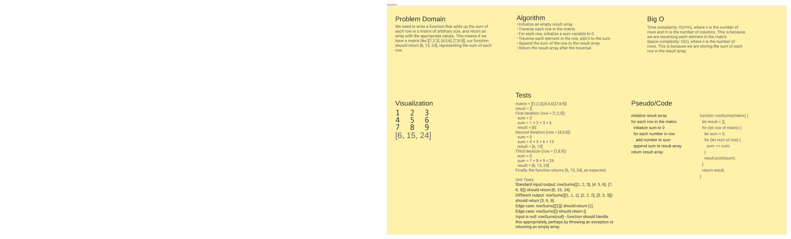

# Code Challenge 01: Reverse-Arrays

<!-- Description of the challenge -->

Write a function that adds up the sum of each row in a matrix of arbitrary size, and return an array with the appropriate values.

## Whiteboard Process

<!-- Embedded whiteboard image -->

 <!-- Replace with actual link -->

## Approach & Efficiency

<!-- What approach did you take? Why? What is the Big O space/time for this approach? -->

Initialize an empty result array.
Traverse each row in the matrix.
For each row, initialize a sum variable to 0.
Traverse each element in the row, add it to the sum.
Append the sum of the row to the result array.
Return the result array after the traversal.

## Solution

<!-- Show how to run your code, and examples of it in action -->

Use a for loop to loop through each row of the matrix

function rowSums(matrix) {
  let result = [];
  for (let row of matrix) {
    let sum = 0;
    for (let num of row) {
      sum += num;
    }
    result.push(sum);
  }
  return result;
}

