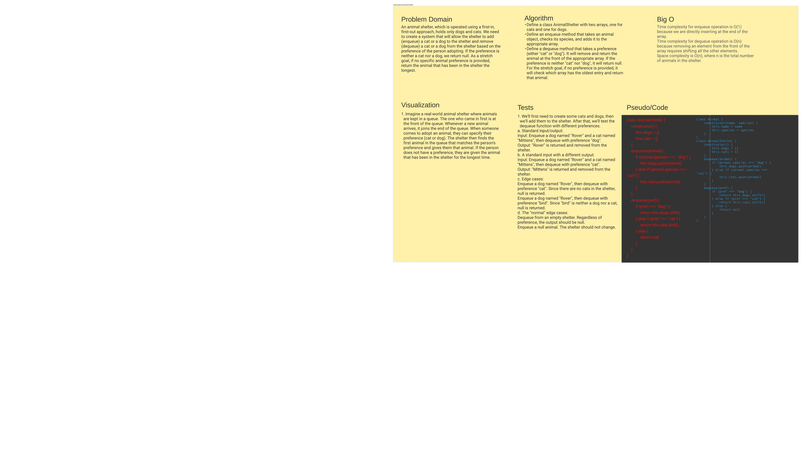

# Code Challenge 02 - Binary Search Array
An animal shelter, which is operated using a first-in, first-out approach, holds only dogs and cats. We need to create a system that will allow the shelter to add (enqueue) a cat or a dog to the shelter and remove (dequeue) a cat or a dog from the shelter based on the preference of the person adopting. If the preference is neither a cat nor a dog, we return null. As a stretch goal, if no specific animal preference is provided, return the animal that has been in the shelter the longest.

## Whiteboard Process

## Approach & Efficiency
Define a class AnimalShelter with two arrays, one for cats and one for dogs.
Define an enqueue method that takes an animal object, checks its species, and adds it to the appropriate array.
Define a dequeue method that takes a preference (either "cat" or "dog"). It will remove and return the animal at the front of the appropriate array. If the preference is neither "cat" nor "dog", it will return null. For the stretch goal, if no preference is provided, it will check which array has the oldest entry and return that animal.

## Solution

