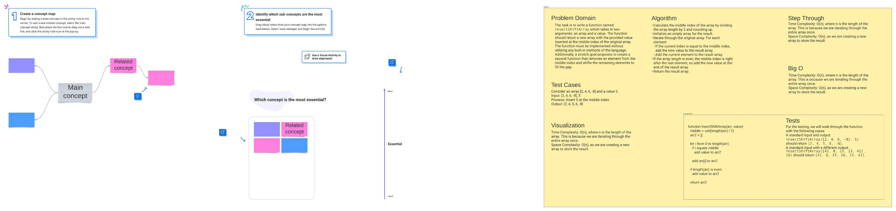

# Code Challenge 01: Reverse-Arrays

<!-- Description of the challenge -->

Take in an array and a number as input, output an array with the number value in the middle of the array

## Whiteboard Process

<!-- Embedded whiteboard image -->

 <!-- Replace with actual link -->

## Approach & Efficiency

<!-- What approach did you take? Why? What is the Big O space/time for this approach? -->

Approach was same as usual using a loop.

## Solution

<!-- Show how to run your code, and examples of it in action -->

Solution was to divide array in half and then iterate through that and if i equals half of the array, then to push the number into the array and then to push the new array if the inital array reached the i value.

function insertShiftArray(arr, num) {
let arr2 = [];
let middle = Math.ceil(arr.length / 2);

for(let i = 0; i < arr.length; i++){
if(i === middle){
arr2.push(num);
}
arr2.push(arr[i]);
}

// If the array length is even, the middle index will be right after the last element,
// so we need to insert the number at the end of the array.
if(arr.length % 2 === 0) {
arr2.push(num);
}

return arr2;
}
