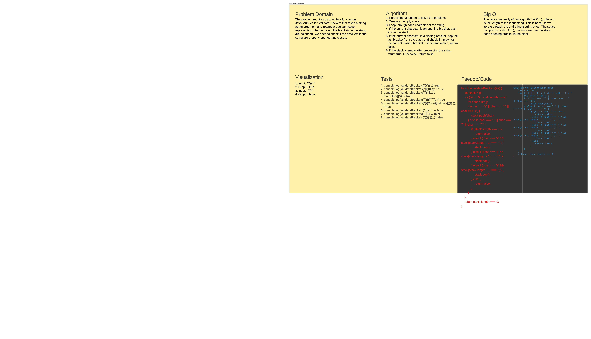

# Code Challenge 13: Bracket Validation
<!-- Description of the challenge -->
The problem requires us to write a function in JavaScript called validateBrackets that takes a string as an argument and returns a boolean value representing whether or not the brackets in the string are balanced. We need to check if the brackets in the string are properly opened and closed.

## Whiteboard Process
<!-- Embedded whiteboard image -->

 <-- Pull #1 / Paper White Board -->

## Approach & Efficiency
<!-- What approach did you take? Why? What is the Big O space/time for this approach? -->
We can solve this problem using a stack. We will iterate through the string s and push each opening bracket onto the stack. When we encounter a closing bracket, we will check if it matches the opening bracket at the top of the stack. If it does not match, return False. If it matches, we will pop the opening bracket from the stack. If the stack is empty at the end of the iteration, the string is valid.

Time Complexity: O(n), where n is the length of the input string.

## Solution
<!-- Show how to run your code, and examples of it in action -->

1. Initialize an empty stack.
2. Iterate through each character in the string s.
3. If the character is an opening bracket, push it onto the stack.
4. If the character is a closing bracket, check if it matches the opening bracket at the top of the stack.
5. If it matches, pop the opening bracket from the stack.
6. If it does not match, return False.
7. After the iteration, if the stack is empty, return True. Otherwise, return False.
