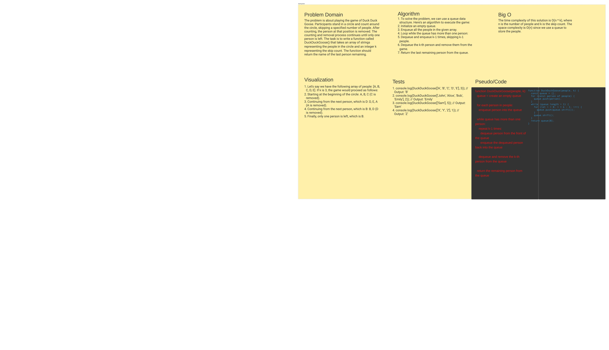

# Code Challenge: Duck Duck Goose

The problem requires us to implement a function called `DuckDuckGoose` that simulates the Duck Duck Goose game. The function takes an array of people and a number `k` as arguments, and it returns the winner of the game.

## Whiteboard Process


## Approach & Efficiency
We can solve this problem using a queue data structure. Here is our approach:
1. Create an empty queue.
2. Iterate through the array of people and enqueue each person into the queue.
3. While the queue length is greater than 1:
    - For `k-1` times, dequeue a person from the front of the queue and enqueue them back into the queue.
    - Dequeue a person from the front of the queue (this person is eliminated).
4. Return the person remaining in the queue, who is the winner of the game.

The time complexity of this solution is O(n * k), where n is the number of people and k is the input number.

## Example
```javascript
const people = ["Alice", "Bob", "Charlie", "David", "Eve"];
const k = 3;
const winner = DuckDuckGoose(people, k);
console.log(winner); // Output: "David"
