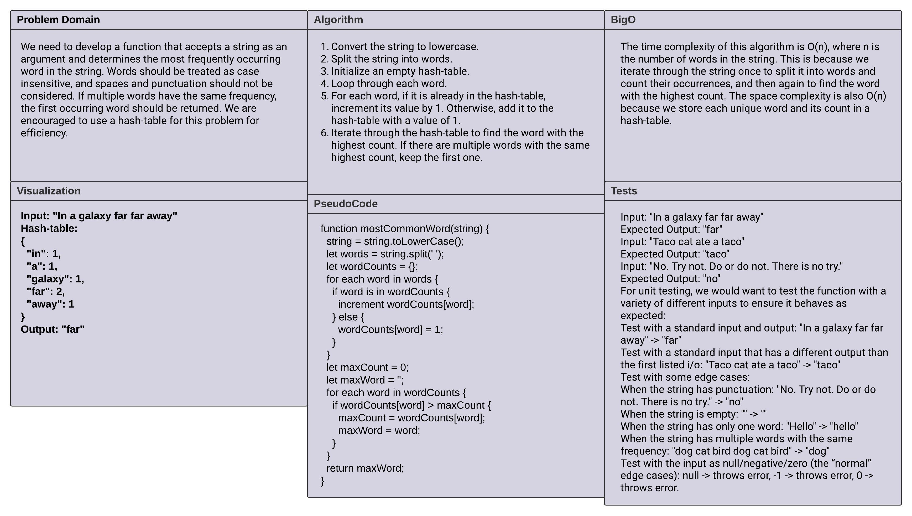

# Code Challenge: frequent-word

## Problem Domain

We need to develop a function that accepts a string as an argument and determines the most frequently occurring word in the string. Words should be treated as case insensitive, and spaces and punctuation should not be considered. If multiple words have the same frequency, the first occurring word should be returned. We are encouraged to use a hash-table for this problem for efficiency.

## Whiteboard Process

The whiteboard process involved visually representing the problem and designing an algorithm to solve it.

## Approach & Efficiency

The time complexity of this algorithm is O(n), where n is the number of words in the string. This is because we iterate through the string once to split it into words and count their occurrences, and then again to find the word with the highest count. The space complexity is also O(n) because we store each unique word and its count in a hash-table.

## Code

[Link to index.js](./index.js)
