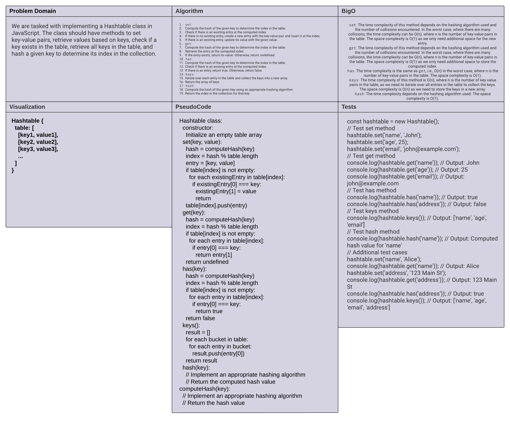

# HashMap Implementation

This repository contains the implementation of a HashMap data structure in JavaScript. A HashMap, also known as a Hash Table, is a data structure that provides fast access to values based on keys. It allows efficient insertion, retrieval, and deletion of key-value pairs.

## Problem Domain

The problem domain for this code is to implement a HashMap data structure with the following functionalities:

- Insertion of key-value pairs.
- Retrieval of values based on keys.
- Checking if a key exists in the HashMap.
- Retrieving all keys present in the HashMap.

## Whiteboard Process

The following image illustrates the high-level structure and key methods of the HashMap implementation:



## Approach to Solving the Problem

The HashMap class is implemented using an array to store the key-value pairs. The size of the array is determined by the provided capacity parameter during initialization. The approach to solving the problem is as follows:

1. **Hash Calculation**: The `calculateHash` method takes a key and calculates a hash value using a hashing algorithm. The hash value determines the index where the key-value pair will be stored in the storage array.

2. **Insertion**: The `insert` method takes a key-value pair and inserts it into the HashMap. It calculates the hash of the key and checks if the storage array at that index is empty. If it is empty, a new LinkedList is created with the key-value pair. If the index already contains a LinkedList, the key-value pair is appended to the existing list.

3. **Retrieval**: The `retrieve` method takes a key and returns the corresponding value from the HashMap. It calculates the hash of the key and checks if the storage array at that index is empty. If it is not empty, it traverses the LinkedList at that index and returns the value associated with the key.

4. **Contains**: The `contains` method takes a key and checks if it exists in the HashMap. It calculates the hash of the key and checks if the storage array at that index is empty. If it is not empty, it traverses the LinkedList at that index and checks if the key exists in any of the nodes.

5. **Key Retrieval**: The `getKeys` method returns an array of all keys present in the HashMap. It iterates over the storage array, traverses each LinkedList, and collects all unique keys.

## Usage

To use the HashMap implementation, follow these steps:

1. Import the `HashMap` class from the module.
2. Create a new instance of the HashMap by providing the desired capacity.
3. Use the HashMap's methods to insert, retrieve, check existence, or get keys.

Example usage:

```javascript
const { HashMap } = require("./index.js");

// Create a new HashMap
const map = new HashMap(10);

// Insert key-value pairs
map.insert("name", "John");
map.insert("age", 30);

// Retrieve values
console.log(map.retrieve("name")); // Output: "John"
console.log(map.retrieve("age")); // Output: 30

// Check existence
console.log(map.contains("name")); // Output: true
console.log(map.contains("city")); // Output: false

// Get all keys
console.log(map.getKeys()); // Output: ["name", "age"]
```
