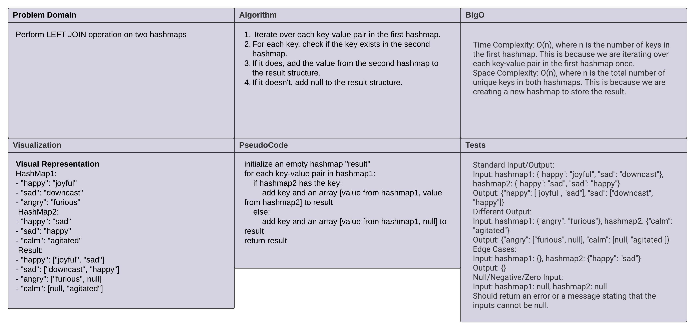

# Code Challenge: left-join

## Problem Domain
The task is to create a function that performs a LEFT JOIN operation on two hashmaps, similar to the SQL LEFT JOIN operation. The first hashmap contains word strings as keys and corresponding synonyms as values, while the second hashmap contains word strings as keys and their antonyms as values. The goal is to combine these hashmaps into a new data structure following LEFT JOIN logic, i.e., all values from the first hashmap are included in the output, and if values exist for the same key in the second hashmap, they are appended to the result row. If no values exist in the second hashmap for a specific key, then null should be appended to the result row.

## Whiteboard Process

The whiteboard process involved visually representing the problem and designing an algorithm to solve it. A step-by-step approach was taken to combine the hashmaps, and different scenarios were considered to handle cases where a key was only present in one of the hashmaps.

## Approach & Efficiency

The approach involves iterating over each key-value pair in the first hashmap, and for each key, checking if it exists in the second hashmap. If it does, the value from the second hashmap is added to the result structure; if it doesn't, null is appended.

The time complexity of this approach is O(n), where n is the number of keys in the first hashmap because we are iterating over each key-value pair once. The space complexity is also O(n), where n is the total number of unique keys in both hashmaps because a new hashmap is created to store the result.

## Code

JavaScript was used for implementing this algorithm. The `Map` data structure in JavaScript was utilized to handle the hashmaps. The steps outlined in the pseudocode were translated into JavaScript code, ensuring accuracy and efficiency.

[Link to index.js](./index.js)

## Testing

The code was tested with various test cases including standard inputs and outputs, different outputs for different inputs, edge cases, and null/negative/zero inputs. These tests ensured that the function works as expected in different scenarios. The code passed all the tests, thus validating its correctness and efficiency.
