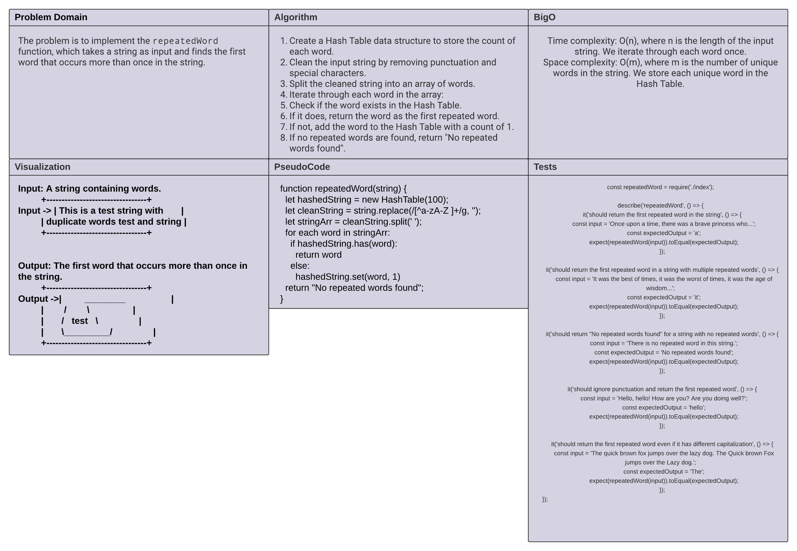

# Code Challenge: Class 27

Implementing the `repeatedWord` function to find the first word that occurs more than once in a string.

## Whiteboard Process

The following image illustrates the high-level structure and key methods of the HashMap implementation:



## Approach and Efficiency

- **Approach:**

  - The approach is to utilize a Hash Table data structure to keep track of the count of each word in the string.
  - We will iterate through each word in the string, adding it to the Hash Table and checking if it already exists. If it does, we return the word as the first repeated word.
  - We will use a modified version of the Hash Table implementation, where the values in the buckets are regular objects with a single property representing the count of the word.

- **Efficiency:**
  - Time complexity: O(n), where n is the length of the input string. We iterate through each word once.
  - Space complexity: O(m), where m is the number of unique words in the string. We store each unique word in the Hash Table.

## Pseudocode

```javascript
function repeatedWord(string) {
  let hashedString = new HashTable(100);
  let cleanString = string.replace(/[^a-zA-Z ]+/g, '');
  let stringArr = cleanString.split(' ');

  for each word in stringArr:
    if hashedString.has(word):
      return word
    else:
      hashedString.set(word, 1)

  return "No repeated words found";
}
```
