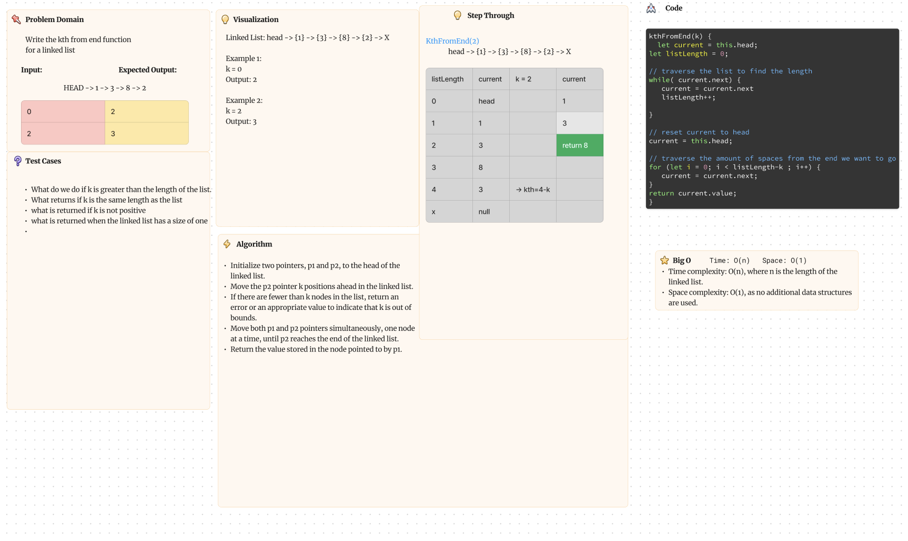

# Code Challenge 07: linked-list-kth

<!-- Description of the challenge -->

Write the kth from end function for a linked list

## Whiteboard Process

<!-- Embedded whiteboard image -->

## Approach & Efficiency

<!-- What approach did you take? Why? What is the Big O space/time for this approach? -->

It initializes two pointers, p1 and p2, to the head of the linked list. These pointers will be used to traverse the list.

The function moves the p2 pointer k positions ahead in the linked list by iterating a for loop k times. If the p2 pointer becomes null before reaching k positions, it means k is greater than the length of the linked list, so the function returns null to indicate that k is out of bounds.

After moving the p2 pointer, both p1 and p2 pointers are moved simultaneously, one node at a time, until the p2 pointer reaches the end of the linked list. This ensures that the distance between p1 and p2 is k nodes.

Once the loop finishes, the function returns the value stored in the node pointed to by p1. This node represents the k-th node from the end of the linked list.

## Solution

<!-- Show how to run your code, and examples of it in action -->

[Link to JS File](./linkedListKth.png)
