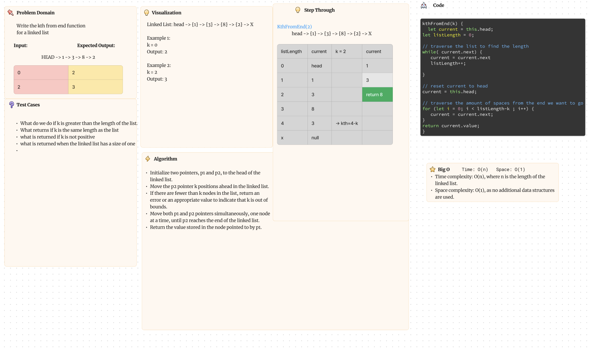

# Code Challenge 09: reverse-linked-list

<!-- Description of the challenge -->

We have been asked to write a function in JavaScript to reverse a singly linked list. A linked list is a data structure that consists of a group of nodes, where each node contains a value and a reference (link) to the next node in the sequence. Reversing a linked list means changing the direction of the 'next' reference in every node such that the last node becomes the first and so on.

## Whiteboard Process

<!-- Embedded whiteboard image -->

## Approach & Efficiency

<!-- What approach did you take? Why? What is the Big O space/time for this approach? -->

It initializes two pointers, p1 and p2, to the head of the linked list. These pointers will be used to traverse the list.

The function moves the p2 pointer k positions ahead in the linked list by iterating a for loop k times. If the p2 pointer becomes null before reaching k positions, it means k is greater than the length of the linked list, so the function returns null to indicate that k is out of bounds.

After moving the p2 pointer, both p1 and p2 pointers are moved simultaneously, one node at a time, until the p2 pointer reaches the end of the linked list. This ensures that the distance between p1 and p2 is k nodes.

Once the loop finishes, the function returns the value stored in the node pointed to by p1. This node represents the k-th node from the end of the linked list.

## Solution

<!-- Show how to run your code, and examples of it in action -->

[Link to JS File](./linkedListKth.png)
