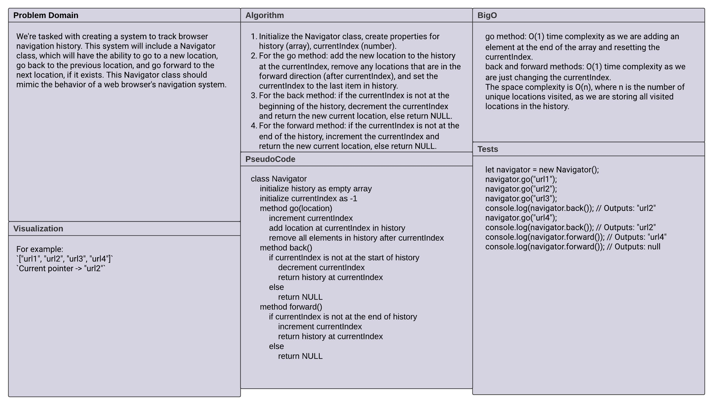

# Code Challenge: Browser Navigation Tracker

## Description of the challenge

We need to create a `Navigator` class that keeps track of browser history and enables us to move back and forward through the history. The class should implement `go`, `back`, and `forward` methods, similar to a web browser's navigation system.

## Whiteboard Process



## Approach & Efficiency

The `Navigator` class uses an array to store the history of visited URLs and an index to keep track of the current location. This approach allows us to easily go back and forward in the history.

- The `go` method adds a new location to the history, removes any forward history, and updates the current index.
- The `back` and `forward` methods decrease and increase the current index respectively, if it's valid to do so.

This approach results in a time complexity of O(1) for all operations because we're essentially manipulating array elements via their indices. The space complexity is O(n) as we're storing the entire history of visited URLs.

## Solution

Here is an implementation of the Navigator class:

```javascript
class Navigator {
  constructor() {
    this.history = [];
    this.currentIndex = -1;
  }

  go(location) {
    this.currentIndex++;
    this.history.splice(this.currentIndex);
    this.history.push(location);
  }

  back() {
    if (this.currentIndex > 0) {
      this.currentIndex--;
      return this.history[this.currentIndex];
    } else {
      return null;
    }
  }

  forward() {
    if (this.currentIndex < this.history.length - 1) {
      this.currentIndex++;
      return this.history[this.currentIndex];
    } else {
      return null;
    }
  }
}
```

And you can use the class like this:

```javascript
let navigator = new Navigator();
navigator.go("url1");
navigator.go("url2");
console.log(navigator.back()); // Outputs: "url1"
navigator.go("url3");
console.log(navigator.back()); // Outputs: "url2"
console.log(navigator.forward()); // Outputs: "url3"
```

This will print "url1" and "url2" to the console, demonstrating the back and forward functionality.
