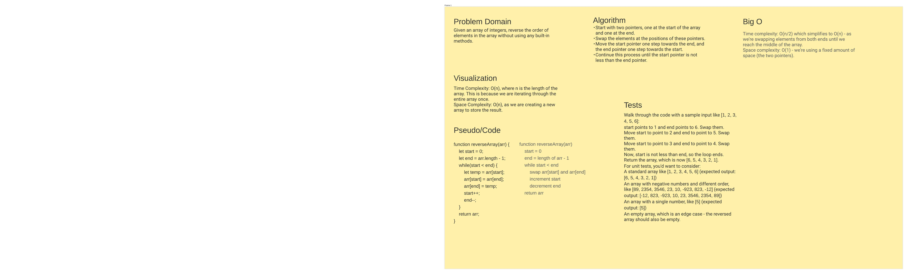

# Code Challenge 01: Reverse-Arrays
<!-- Description of the challenge -->
Take in an array and return a reversed version

## Whiteboard Process
<!-- Embedded whiteboard image -->
 <!-- Replace with actual link -->
 <-- Pull #1 / Paper White Board -->

## Approach & Efficiency
<!-- What approach did you take? Why? What is the Big O space/time for this approach? -->
Approach was same as usual using a loop.

## Solution
<!-- Show how to run your code, and examples of it in action -->

Solution was just to loop through the array in reverse

function reverseArr(arr) {
  let arr2 = [];
  for(let i = 0; i <= arr.length; i++){
    arr2.push(arr[arr.length - i]);
  }
  return arr2;
}

let x = [1,2,3,4,5];
reverseArr(x);
