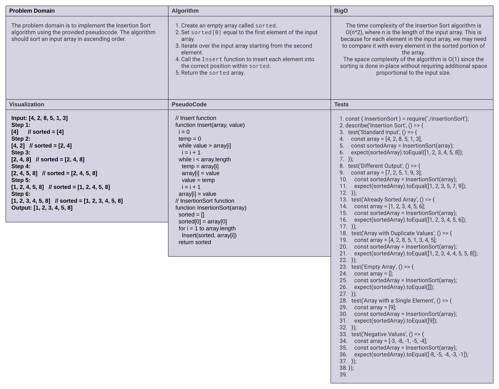

# Code Challenge: Insertion Sort

In this code challenge, we are provided with pseudocode for the `Insert` and `InsertionSort` functions. Our task is to understand and trace the algorithm step-by-step using a sample array. Let's break down the pseudocode and visualize the process.

## Whiteboard Process

### Insert()


The `Insert` function takes a sorted array and a value as parameters. It finds the correct position for the value within the sorted array and inserts it while maintaining the sorted order.

### InsertionSort()



The `InsertionSort` function performs the Insertion Sort algorithm on an input array. It creates a new empty array `sorted` and gradually inserts each element from the input array into the correct position in `sorted`.

## Approach and Efficiency

The approach is to iterate over the input array, calling the `Insert` function for each element to insert it into the correct position within the `sorted` array. The time complexity of this approach is O(n^2) since the `Insert` function is called for each element (except the first one) in the input array.

## Solution

Here's the code implementation based on the provided pseudocode:

```javascript
const Insert = (array, value) => {
  let i = 0;
  let temp = 0;
  while (value > array[i]) {
    i++;
  }
  while (i < array.length) {
    temp = array[i];
    array[i] = value;
    value = temp;
    i++;
  }
  array[i] = value;
}

const InsertionSort = (array) => {
  let sorted = [];
  sorted[0] = array[0];
  for(let i = 1; i < array.length; i++) {
    Insert(sorted, array[i]);
  }
  return sorted;
}
