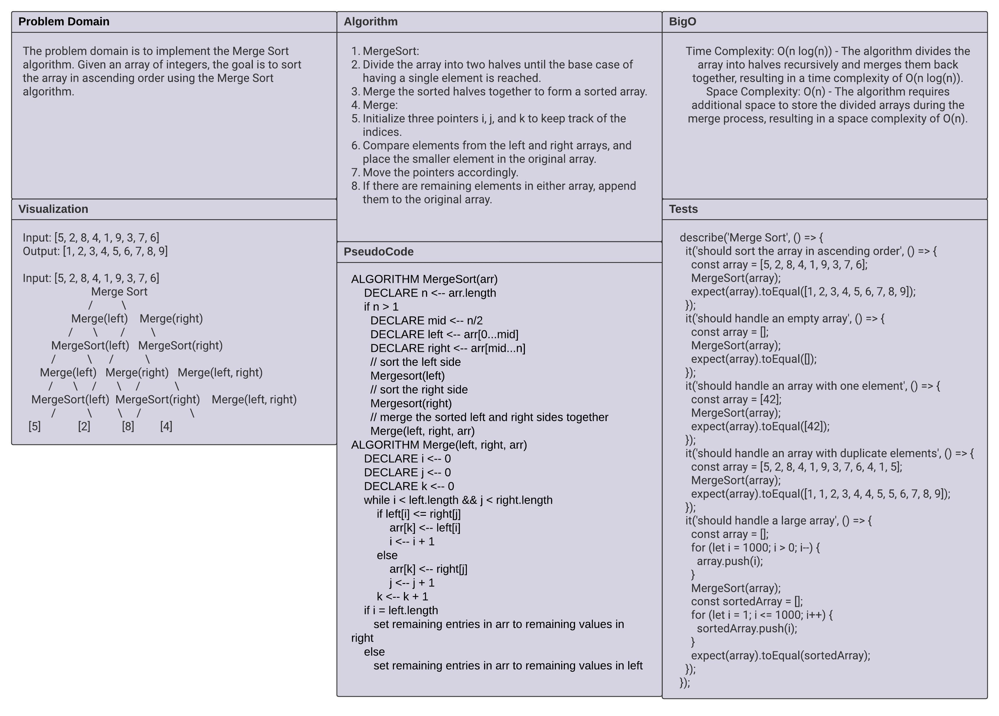

# Code Challenge: Merge Sort

In this code challenge, we are provided with pseudocode for the `MergeSort` and `Merge` functions. Our task is to understand and trace the algorithm step-by-step using a sample array. Let's break down the pseudocode and visualize the process.

## Whiteboard Process

To better understand the algorithm, we can represent it using UML diagrams. Let's go through each step of the process:

### Overview



### Merge()


The `Merge` function takes two sorted subarrays, `left` and `right`, and merges them into a single sorted array, `arr`. It compares the elements from `left` and `right` and inserts them into `arr` in the correct order.

### MergeSort()

The `MergeSort` function implements the Merge Sort algorithm. It recursively divides the input array into smaller subarrays until each subarray contains only one element. Then it calls the `Merge` function to merge the subarrays back together in sorted order.

## Approach and Efficiency

The Merge Sort algorithm follows a divide-and-conquer approach. It divides the input array into smaller subarrays, recursively sorts the subarrays, and then merges them to produce a sorted array. The time complexity of Merge Sort is O(n log(n)), where n is the number of elements in the array. This makes Merge Sort an efficient sorting algorithm, especially for large datasets.

## Solution

Here's the code implementation based on the provided pseudocode:

```javascript
const Merge = (left, right, arr) => {
  let i = 0;
  let j = 0;
  let k = 0;

  while (i < left.length && j < right.length) {
    if (left[i] <= right[j]) {
      arr[k] = left[i];
      i++;
    } else {
      arr[k] = right[j];
      j++;
    }
    k++;
  }

  if (i === left.length) {
    for (; j < right.length; j++) {
      arr[k] = right[j];
      k++;
    }
  } else {
    for (; i < left.length; i++) {
      arr[k] = left[i];
      k++;
    }
  }
}

const MergeSort = (arr) => {
  let n = arr.length;

  if (n > 1) {
    let mid = Math.floor(n / 2);
    let left = arr.slice(0, mid);
    let right = arr.slice(mid);
    MergeSort(left);
    MergeSort(right);
    Merge(left, right, arr);
  }
}
