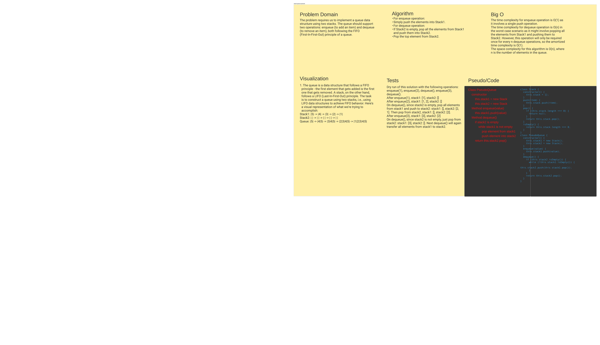

# Code Challenge 11: stack-queue-pseudo

<!-- Description of the challenge -->

The problem requires us to implement a queue data structure using two stacks. The queue should support two operations: enqueue (to add an item) and dequeue (to remove an item), both following the FIFO (First-In-First-Out) principle of a queue.

## Whiteboard Process

<!-- Embedded whiteboard image -->

## Approach & Efficiency

<!-- What approach did you take? Why? What is the Big O space/time for this approach? -->

For enqueue operation:
Simply push the elements into Stack1.
For dequeue operation:
If Stack2 is empty, pop all the elements from Stack1 and push them into Stack2.
Pop the top element from Stack2.

## Solution

<!-- Show how to run your code, and examples of it in action -->

[Link to JS File](./index.js)
