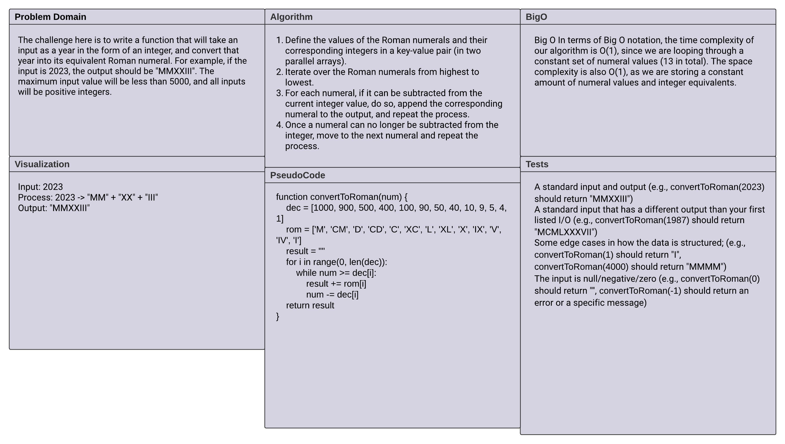

# Code Challenge 42: Convert Integer to Roman Numerals
<!-- Description of the challenge -->
The problem requires us to write a function in JavaScript called `convertToRoman` that takes an integer as an argument and returns a string representing the Roman numeral equivalent of the integer. We are asked to convert positive integers less than 5,000 into their Roman numeral representation.

## Whiteboard Process
<!-- Embedded whiteboard image -->


## Approach & Efficiency
<!-- What approach did you take? Why? What is the Big O space/time for this approach? -->
We can solve this problem using an iterative approach. We prepare an array of decimal equivalents and their respective Roman numeral representations. We start from the largest decimal number (1000) and keep subtracting it from the input number while appending the equivalent Roman numeral to the result. We continue this process until the number becomes zero.

Time Complexity: The time complexity is O(1), which means the time taken by the function does not increase with the input size. This is because, irrespective of the input size, the function traverses a fixed size array (size 13).

## Solution
<!-- Show how to run your code, and examples of it in action -->

1. Initialize two arrays, `dec` and `rom`, representing the decimal and Roman numeral values, respectively.
2. Initialize an empty string `result` to store the final Roman numeral string.
3. Iterate through the `dec` array starting from the largest decimal number.
4. For each decimal number, while it can be subtracted from the input number `num`, subtract it and append the equivalent Roman numeral to `result`.
5. Continue this process until `num` becomes zero.
6. Return `result` which is the Roman numeral representation of the input number.

Example:

If the function `convertToRoman` is called with the number 2023, it will return the string "MMXXIII", which is the Roman numeral representation of 2023.

```
convertToRoman(2023) // Output: "MMXXIII"
```
