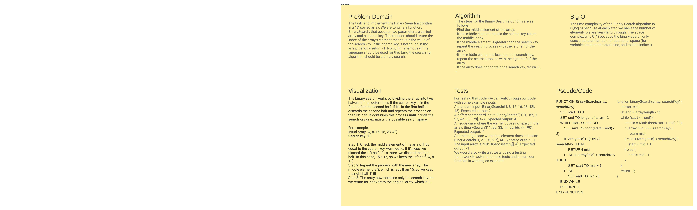

# Code Challenge 01: Binary Search

<!-- Description of the challenge -->

To implement the binary search algorithm in a 1D sorted array

## Whiteboard Process

<!-- Embedded whiteboard image -->

 <!-- Replace with actual link -->

## Approach & Efficiency

<!-- What approach did you take? Why? What is the Big O space/time for this approach? -->

The steps for the Binary Search algorithm are as follows:
Find the middle element of the array.
If the middle element equals the search key, return the middle index.
If the middle element is greater than the search key, repeat the search process with the left half of the array.
If the middle element is less than the search key, repeat the search process with the right half of the array.
If the array does not contain the search key, return -1.


## Solution

<!-- Show how to run your code, and examples of it in action -->

function binarySearch(array, searchKey) {
    let start = 0;
    let end = array.length - 1;
    while (start <= end) {
        let mid = Math.floor((start + end) / 2);
        if (array[mid] === searchKey) {
            return mid;
        } else if (array[mid] < searchKey) {
            start = mid + 1;
        } else {
            end = mid - 1;
        }
    }
    return -1;
}

