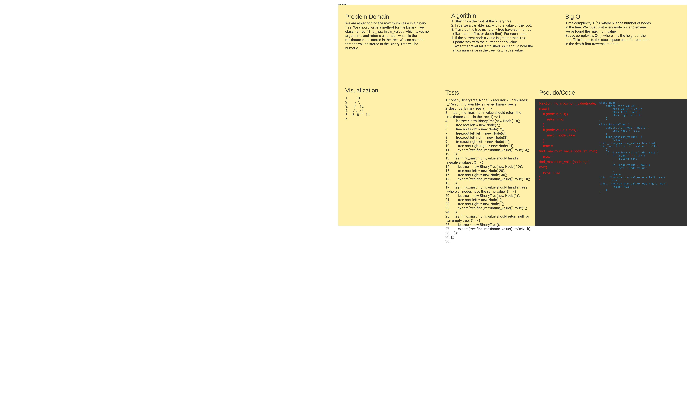

# Code Challenge: Find Maximum Value in Binary Tree

## Whiteboard Process

The whiteboard diagram visualizes a binary tree, its nodes, and the traversal process that the `find_maximum_value` method uses to find the maximum value.



## Approach & Efficiency

The problem was solved by using a depth-first traversal approach starting from the root of the tree. A helper function, `_find_maximum_value`, is used to traverse the tree. This function takes the current node and the current maximum value as arguments. If the current node is `null`, the function returns the current maximum value. If the node's value is greater than the current maximum value, the function updates the maximum value. The function then recursively calls itself with the left and right children of the current node.

The time complexity of the function is O(n), where n is the number of nodes in the tree. This is because each node in the tree needs to be visited once in order to determine the maximum value.

The space complexity of the function is O(h), where h is the height of the tree. This is due to the stack space utilized for the recursive calls during the depth-first traversal.

## Code

The `BinaryTree` class and the `Node` class are defined in the [index.js](./index.js) file. The `find_maximum_value` method of the `BinaryTree` class implements the algorithm described above.

## Testing

Jest is used for unit testing the `find_maximum_value` method. The test cases cover different types of binary trees, including balanced trees, unbalanced trees, trees with negative values, trees where all nodes have the same value, and an empty tree.

You can run the tests using the following command:

```bash
jest BinaryTree.test.js

