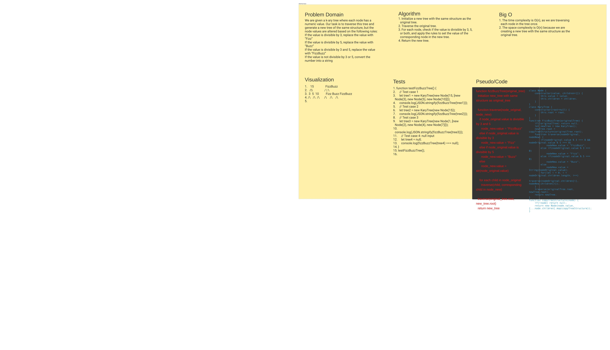

# Code Challenge: FizzBuzz K-ary Tree

A coding challenge that involves traversing a k-ary tree and generating a new one based on specific criteria.

## Challenge Description

Given a k-ary tree where each node has a numeric value, we need to traverse this tree and create a new tree of the same structure. The node values in the new tree should be altered based on the following rules:
- If the value is divisible by 3, replace the value with "Fizz"
- If the value is divisible by 5, replace the value with "Buzz"
- If the value is divisible by both 3 and 5, replace the value with "FizzBuzz"
- If the value is not divisible by 3 or 5, convert the number into a string

## Whiteboard Process

For a visual representation of the problem and the solution approach, please refer to the whiteboard diagram below:

## Approach & Efficiency

The solution follows these steps:
1. Initialize a new tree with the same structure as the original tree.
2. Traverse the original tree.
3. For each node, check if the value is divisible by 3, 5, or both, and apply the rules to set the value of the corresponding node in the new tree.
4. Return the new tree.

This approach has a time and space complexity of O(n), where n is the number of nodes in the tree. We traverse each node once and create a new tree with the same structure.

## Code

The solution is implemented in JavaScript. The `KaryTree` and `Node` classes are defined, along with the `fizzBuzzTree` function which implements the algorithm described above.

You can find the code in the [index.js](./index.js) file.

## Testing

The code has been tested with various test cases to ensure its correctness. These include standard cases, edge cases, and normal edge cases such as null input (an empty tree).

To run the tests, execute the `testFizzBuzzTree` function in the [index.js](./index.js) file.
